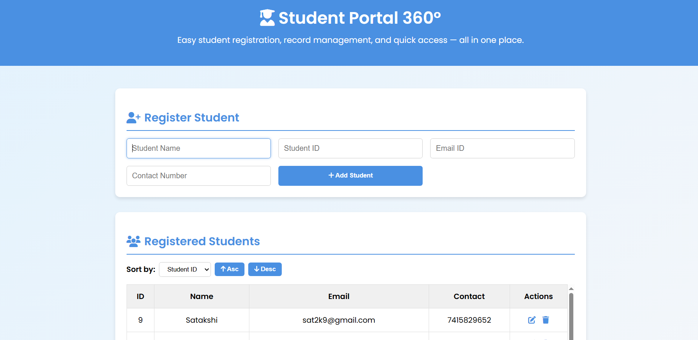

# Student Registration System

## Overview
The Student Registration System is a web-based application that allows students to register their personal details such as Name, Student ID, Email, and Contact Number.  

It provides features to add, edit, delete, and view student records in a user-friendly interface.  
All data is stored in the browser’s Local Storage, making it available even after refreshing the page.  
The system is fully responsive and works on mobile, tablet, and desktop devices.  

---

## Features
- Register new students with:
  - Student Name
  - Student ID
  - Email ID
  - Contact Number
- Display all registered students in a structured table  
- Edit and update existing student records  
- Delete unwanted student records  
- Input validation:
  - Name → only alphabets allowed  
  - Student ID → only numbers allowed  
  - Email → must follow valid email format  
  - Contact Number → minimum 10 digits  
- Data persistence using Local Storage (data remains after page refresh)  
- Responsive design (mobile, tablet, desktop)  
- Dynamic vertical scrollbar when records exceed table height  

---

## File Structure
Student-Registration-System/
├── index.html # HTML structure
├── style.css # Styling and responsiveness
├── script.js # JavaScript functionality and local storage
└── README.md # Documentation

---

## How to Run
1. Download the project folder.  
2. Open index.html in any browser.  
3. Start registering students.  

---

## Screenshot

---

## GitHub Repository
[Click here to view the repository](https://github.com/deepikarani2k3/StudentRegistrationSystem)
